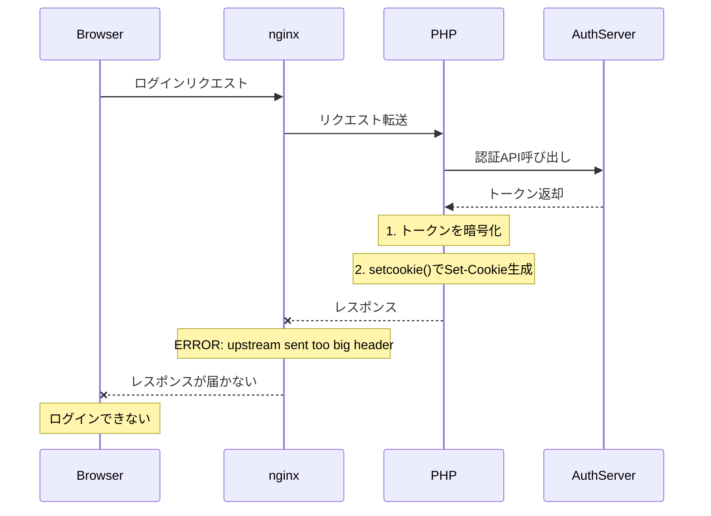
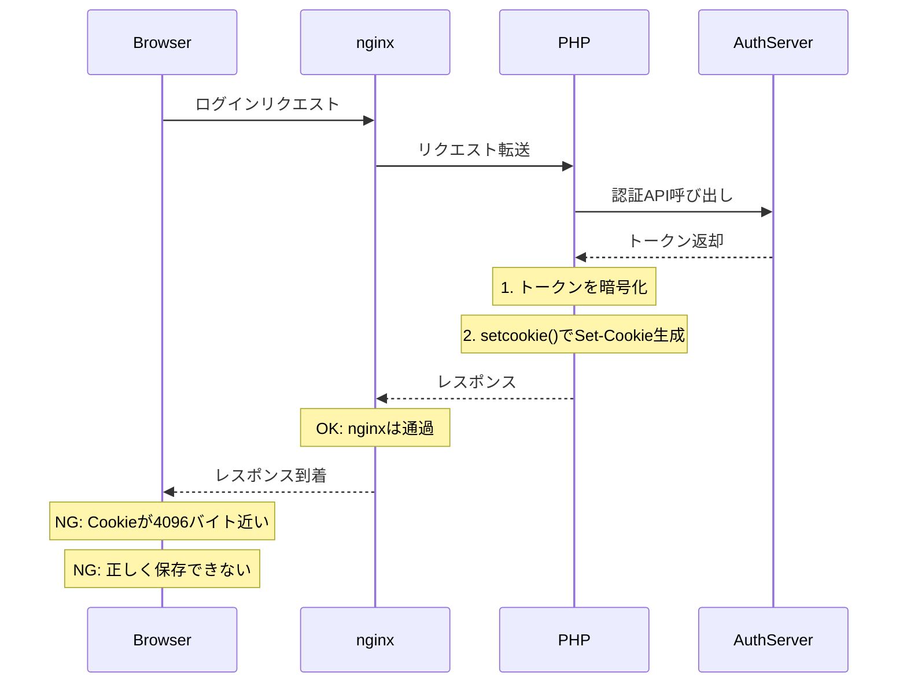
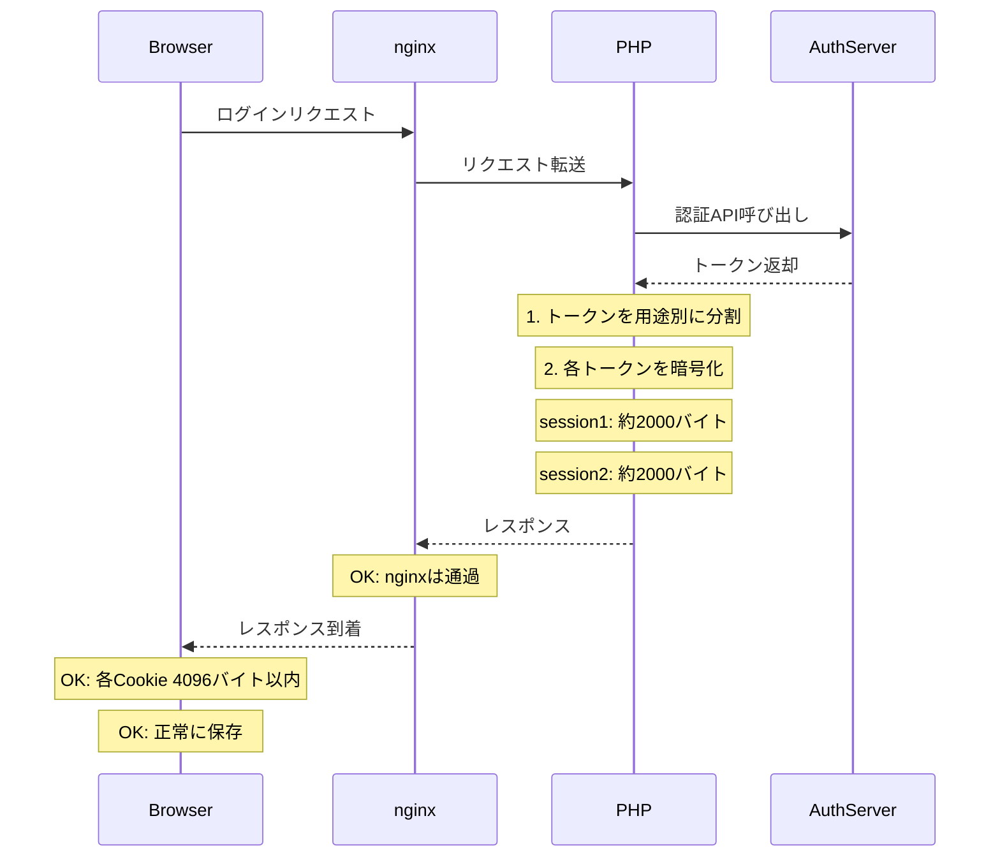
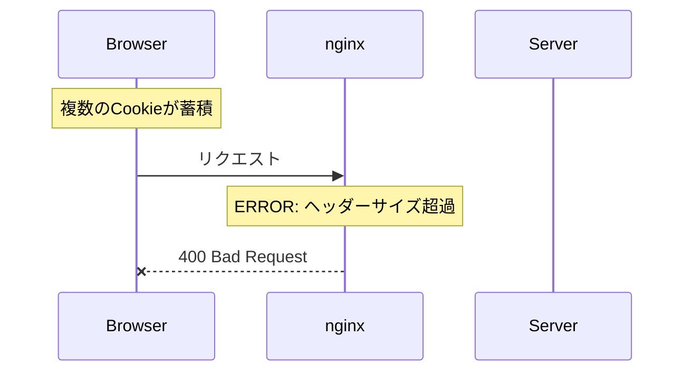
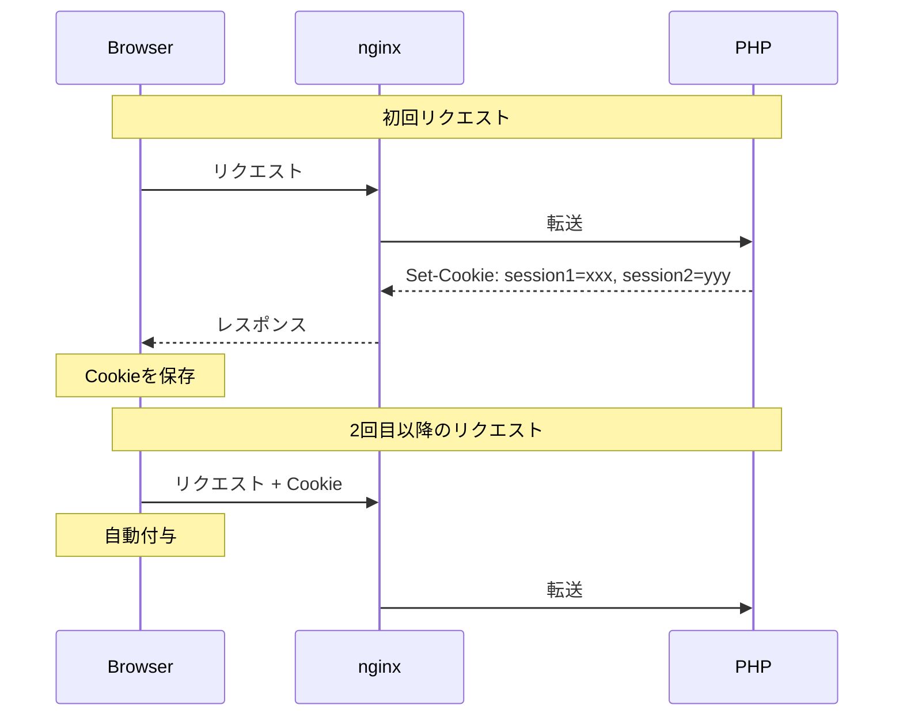

[1人アドベントカレンダー2025](https://zenn.dev/megusunu/articles/20251130-advent-calendar-2025#%E8%A8%98%E4%BA%8B%E4%B8%80%E8%A6%A7) 3日目。

今日は、技術記事です。Zennでの技術記事は初めてですね！何かの参考になれば幸いです。

---

## エラーとの遭遇

ある日、認証システムを実装していたら、ログイン情報を入力後に突然こんなエラーが出ました。

（あれ？昨日は普通にログインできた気がするんだけどなぁ…。ローカルでモックAPIでしかテストしてなかったっけ？）

```
upstream sent too big header while reading response header from upstream
```

しかも、ユーザーによってエラーが出たり出なかったり…。

最初は「nginx設定の問題かな」くらいに思っていたのですが、調べていくうちに**2つの問題**があることがわかりました。

---

## 結論：2つの対策が必要だった

先に結論を書くと、この問題には**2つの対策**が必要でした。

| 問題 | 発生箇所 | 原因 | 解決策 |
|------|----------|------|--------|
| **nginx バッファ不足** | nginx（サーバー側） | Set-Cookieヘッダーがバッファに収まらない | `fastcgi_buffer_size` 拡大 |
| **Cookie 4096バイト制限** | ブラウザ側 | 1つのCookieに全情報を詰め込んだ | Cookieを論理的に分割 |

私の場合は、どちらか一方だけでは完全に解決しませんでした。以下、順を追って説明します。

---

## 処理フローで理解する

### 対策前（nginxバッファ修正なし）



### nginxバッファ修正後（Cookie分割なし）



### 両方の対策後（最終形）



---

## 原因調査の流れ

### 1. まずnginxバッファを拡大（応急処置）

エラーメッセージ `upstream sent too big header` の通り、まずは、nginxのバッファサイズを拡大しましたが、状況は改善しませんでした。

→ エラーメッセージは解消したが、ログインが安定しない状態でした。

### 2. デバッグログで詳細調査

PHPにデバッグログを仕込んで調査：

```
AccessToken Length: 1085
RefreshToken Length: 1804
Encrypted Data Length: 4032
```

**暗号化後のCookieデータが4032バイト** → Cookieサイズ制限の4096バイトギリギリ！

### 3. なぜ4096バイトを超えたか

1つのCookieに以下をすべて格納していた：
- アクセストークン（JWT形式、1085バイト）
- リフレッシュトークン（1804バイト）
- その他の認証情報

これらを**暗号化**して保存するので4096バイトを超えてしまいました。ユーザーによってトークンサイズが異なる（エンコード時のサイズが異なる）こともあり、エラーが出たり出なかったり安定しませんでした。

### 4. 2つの問題の違い

| 問題 | 原因 | 発生タイミング |
|------|------|----------------|
| nginxエラー | fastcgiバッファサイズ不足 | PHPがnginxにレスポンスを返す時点 |
| Cookie制限 | ブラウザの仕様（RFC 6265） | ブラウザがCookieを保存する時点 |

---

## 解決策の検討

Cookie制限については、いくつかの選択肢がありました。

**1. Cookieを物理的に分割する**
`str_split`で文字列を分割して複数のCookieに保存する。（シンプルだが、マージしてエンコードする必要があるなど管理が煩雑になる）

**2. 必要な情報のみ保存する**
不要な情報を削除してCookieのサイズを減らす。

**3. セッションストレージを使う**
サーバー側にトークンを保存し、CookieにはセッションIDだけ入れる。セキュリティは高いが、サーバー側の実装が必要。

**4. ローカルストレージに保存する**
必要な情報をCookieではなく、ローカルストレージに保存する。

**5. 論理的に用途別に分離する**
単純なバッファサイズで分割するのとは違い、アクセストークンとリフレッシュトークンなど、情報のカテゴリー別にCookieに保存する。

---

## 採用した解決策

最終的に、**nginx設定変更**に加え、5の**論理的な用途別分離**の組み合わせを採用しました。

理由としては、1はsplitするのは問題ないですが、利用するときに面倒と思ったので却下。
2は、すでに必要な情報しかないため選択できない。
3は、今回はFEだけで解決したかったので却下。
4は、ローカルストレージの利用は、Safariの場合は7日間しか保存できないなど、ブラウザによってはCookieより利用しづらいので避けたい。
このため、5を選択しました。

- nginx設定変更 → `upstream sent too big header` を解消
- Cookie分割 → ブラウザの4096バイト制限を解消

---

## 実装：nginx設定変更

### fastcgi設定の調整（レスポンス側）

```nginx
# /etc/nginx/nginx.conf または sites-available/example.conf

location ~ \.php$ {
    fastcgi_buffer_size 32k;       # デフォルト4k → 32k
    fastcgi_buffers 8 32k;          # デフォルト8 4k → 8 32k
    fastcgi_busy_buffers_size 64k;  # デフォルト8k → 64k

    # その他のfastcgi設定：
    fastcgi_pass unix:/var/run/php/php-fpm.sock;
    fastcgi_index index.php;
    include fastcgi_params;
}
```

### 各設定の意味

| 設定 | 方向 | 役割 |
|------|------|------|
| `fastcgi_buffer_size` | レスポンス側 | 最初のレスポンスヘッダー用バッファ。Set-Cookieはここに含まれる |
| `fastcgi_buffers` | レスポンス側 | レスポンスボディ用のバッファ数とサイズ |
| `fastcgi_busy_buffers_size` | レスポンス側 | クライアントへの送信中に使用できるバッファの最大サイズ |

### 設定の反映

```bash
# 設定ファイルの構文チェック
sudo nginx -t

# 問題なければリロード
sudo systemctl reload nginx
```

---

## 実装：Cookie論理分割

### 考え方

今回は、物理的に`str_split`で分割するのではなく、用途に応じてCookieを分けることにしました。

- **session1**：アクセストークンのみ（頻繁に使用）
- **session2**：リフレッシュトークン + その他の認証情報（再認証用）

こうすることで、各Cookieが4096バイト以内に収まり、かつ管理もシンプルになります。

### 暗号化の実装

トークンは平文でCookieに保存すべきではありませんので、AES-256-CBCで暗号化し、HMAC-SHA256で改ざん検知を行います。

```php
const CIPHER = 'AES-256-CBC';
const KEY = 'your-secret-key-here'; // 実際は環境変数から取得

function encryptData($data) {
    $ivlen = openssl_cipher_iv_length(CIPHER);
    $iv = openssl_random_pseudo_bytes($ivlen);
    $plaintext = json_encode($data);

    // AES-256-CBCで暗号化
    $ciphertext_raw = openssl_encrypt(
        $plaintext,
        CIPHER,
        KEY,
        OPENSSL_RAW_DATA,
        $iv
    );

    // HMAC-SHA256で改ざん検知
    $hmac = hash_hmac('sha256', $iv . $ciphertext_raw, KEY, true);

    // 最終形式: base64(iv + hmac + ciphertext)
    return base64_encode($iv . $hmac . $ciphertext_raw);
}

function decryptData($encrypted) {
    $c = base64_decode($encrypted);
    $ivlen = openssl_cipher_iv_length(CIPHER);

    $iv = substr($c, 0, $ivlen);
    $hmac = substr($c, $ivlen, 32);
    $ciphertext_raw = substr($c, $ivlen + 32);

    // HMAC検証
    $calcmac = hash_hmac('sha256', $iv . $ciphertext_raw, KEY, true);
    if (!hash_equals($hmac, $calcmac)) {
        return null; // 改ざん検知
    }

    $plaintext = openssl_decrypt(
        $ciphertext_raw,
        CIPHER,
        KEY,
        OPENSSL_RAW_DATA,
        $iv
    );

    return json_decode($plaintext, true);
}
```

### トークン保存の実装

```php
function saveAuthTokens($accessToken, $refreshToken) {
    $exp = time() + 86400; // 24時間
    $options = [
        'expires' => $exp,
        'path' => '/',
        'domain' => '',
        'secure' => true,    // HTTPS必須
        'httponly' => true,  // JavaScript からアクセス不可
        'samesite' => 'Lax'  // CSRF対策
    ];

    // session1: アクセストークン（頻繁に使用）
    setcookie(
        'session1',
        encryptData(['token' => $accessToken]),
        $options
    );

    // session2: リフレッシュトークン（再認証用）
    setcookie(
        'session2',
        encryptData(['token' => $refreshToken]),
        $options
    );
}

function getAccessToken() {
    $data = decryptData($_COOKIE['session1'] ?? '');
    return $data['token'] ?? null;
}

function getRefreshData() {
    return decryptData($_COOKIE['session2'] ?? '');
}
```

### Cookie名の設計意図

Cookie名を`session1`、`session2`のようにシンプルにしています。実務では、より推測しにくい名前（`_t1`など）を使うこともありますが、重要なのはCookie名ではなく、暗号化とセキュリティ属性の設定になります。

---

## 結果

この対応後、すべてのユーザーで安定してログインが成功するようになりました。

パフォーマンスへの影響も確認しましたが、レスポンス速度はほぼ変化なしでした。（メモリ使用量は微増しましたが、許容範囲内でした。）

---

## おまけ：リクエスト側でも同様のエラーが発生した話

### 問題解決後に発生した別のエラー

上記の問題を解決した後、テストアカウントで繰り返しテストしていたら、**また別のエラー**が発生しました。

```
400 Bad Request
Request Header Or Cookie Too Large
```

### 何が起きたか



### 原因

1. テストを繰り返すうちに、ブラウザに**複数のCookieが蓄積**
2. 次のリクエスト時、ブラウザが**全てのCookieを自動的にリクエストヘッダーに付与**
3. リクエストヘッダーの合計サイズがnginxの制限（`large_client_header_buffers`）を超過
4. → `400 Bad Request` エラー

### ポイント：ブラウザの自動送信機能

**ブラウザは、保存したCookieを次回以降のリクエストで自動的にヘッダーに含めます。**

これはHTTP仕様（[RFC 6265](https://datatracker.ietf.org/doc/html/rfc6265)）で定められたブラウザの標準動作です。フロントエンドのコードで明示的に設定する必要はありません。

> When the user agent makes an HTTP request, it includes the applicable, non-expired cookies in the Cookie header.
> — RFC 6265 Section 5.4

参考：[MDN Web Docs - Cookie](https://developer.mozilla.org/en-US/docs/Web/HTTP/Headers/Cookie)



つまり、**フロントエンドのコードを書いていなくても、Cookieはリクエストヘッダーに含まれます**。

### レスポンス側とリクエスト側の違い

| 問題 | 方向 | nginx設定 | エラーメッセージ |
|------|------|-----------|-----------------|
| 今回の本題 | サーバー → ブラウザ | `fastcgi_buffer_size` | `upstream sent too big header` |
| おまけの問題 | ブラウザ → サーバー | `large_client_header_buffers` | `Request Header Or Cookie Too Large` |

### 解決策

nginx設定で`large_client_header_buffers`を調整：

```nginx
# /etc/nginx/nginx.conf

http {
    # リクエストヘッダー用バッファ（デフォルト: 4 8k）
    large_client_header_buffers 4 32k;

    # ...
}
```

### なぜこの問題が発生しやすいか

- **テスト環境で繰り返しログイン/ログアウト** → Cookieが蓄積
- **複数のサブドメインで同じCookieを使用** → 重複してCookieが送信される
- **有効期限の長いCookieが残っている** → 古いCookieと新しいCookieが両方送信される

### 教訓

Cookieを扱う際は、**レスポンス側（Set-Cookie）とリクエスト側（Cookie）の両方**でサイズ制限があることを意識する必要があります。

---

## セキュリティのまとめ

今回の実装で意識したセキュリティ設定をまとめます。

### Cookieの属性

| 属性 | 設定値 | 理由 |
|------|--------|------|
| `HttpOnly` | true | XSS攻撃でJavaScriptからCookieを読み取られることを防ぐ |
| `Secure` | true | HTTPS通信でのみCookieを送信 |
| `SameSite` | Lax | CSRF攻撃を軽減。外部サイトからのPOSTリクエストでCookieを送信しない |

### 暗号化

| 項目 | 採用した方式 |
|------|-------------|
| 暗号化アルゴリズム | AES-256-CBC |
| 改ざん検知 | HMAC-SHA256 |
| IV（初期化ベクトル） | 毎回ランダム生成 |

---

## 注意点まとめ

### Cookieサイズに関する制限一覧

| 制限 | 場所 | nginx設定 | 制限値 |
|------|------|-----------|--------|
| 1つのCookieのサイズ | ブラウザ | - | 4096バイト（RFC 6265） |
| Set-Cookieヘッダーサイズ | nginx（レスポンス側） | `fastcgi_buffer_size` | デフォルト4k |
| Cookieヘッダーサイズ | nginx（リクエスト側） | `large_client_header_buffers` | デフォルト8k×4 |
| ドメインあたりのCookie数 | ブラウザ | - | RFC 6265では50個だが、現代のブラウザは180個程度 |

### 他の選択肢

今回はCookieに保存する方法を採用しましたが、要件によっては以下の選択肢も検討すべきです。

- **セッションストレージ**：サーバー側にトークンを保存し、CookieにはセッションIDのみ保存。セキュリティは高いが、サーバー側の実装が必要
- **localStorage**：クライアント側に保存。JavaScriptからアクセスできるため、XSS攻撃に弱い。認証トークンの保存には推奨しない

---

## おわりに

`upstream sent too big header` というエラーメッセージだけ見ると、何が悪いのかわかりにくいです。

今回の問題は**2つの対策**が必要でした：

1. **nginx設定変更** → `upstream sent too big header` を解消
2. **Cookie分割** → ブラウザの4096バイト制限を解消

さらに、テスト中に**リクエスト側のCookieサイズ制限**にも遭遇しました。Cookieを扱う際は、レスポンス側とリクエスト側の両方でサイズ制限があることを意識しておくと、トラブルシューティングがスムーズになります。

同じエラーで詰まった人の助けになれば。

---

明日は「エンジニアがペット用ニットウェアを作り始めた理由」を書きます。

📚 [1人アドベントカレンダー2025 全記事一覧](https://zenn.dev/megusunu/articles/20251130-advent-calendar-2025#%E8%A8%98%E4%BA%8B%E4%B8%80%E8%A6%A7)

---

**megusunu**

🐦 [X (@megusunu)](https://x.com/megusunu)
🧶 [megusunuLab](https://www.instagram.com/megusunu/)（ハンドメイド）
🏢 [Wells合同会社](https://wells.jp)
